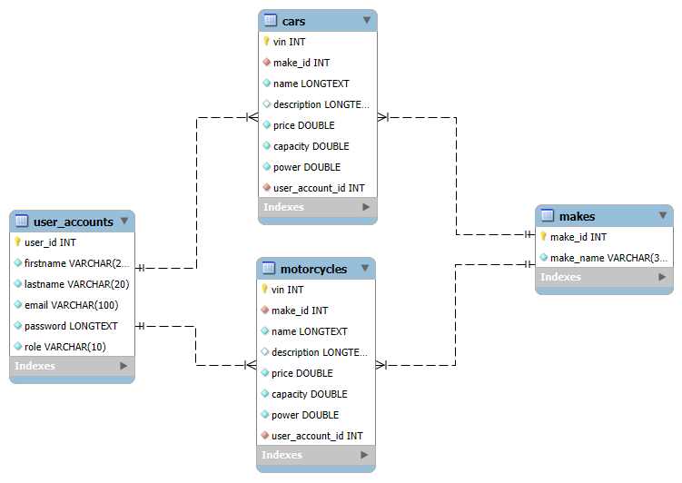
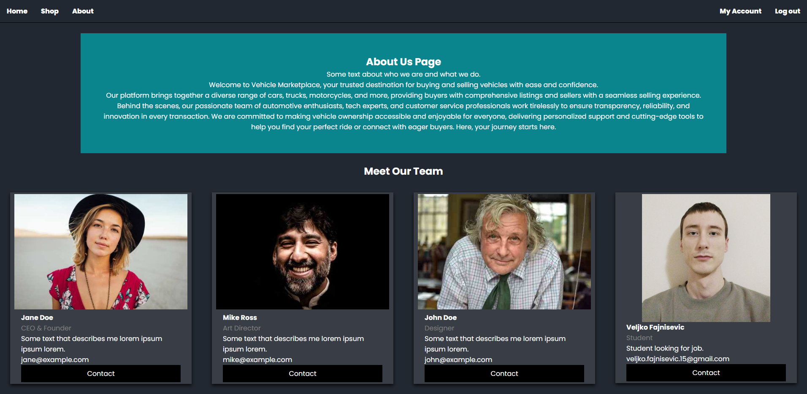
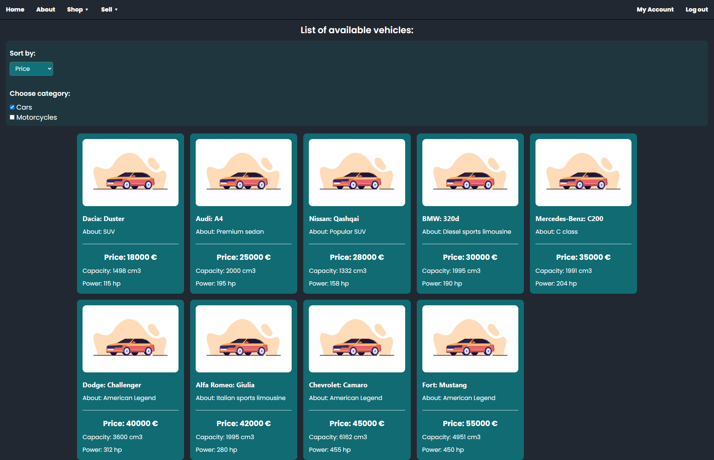
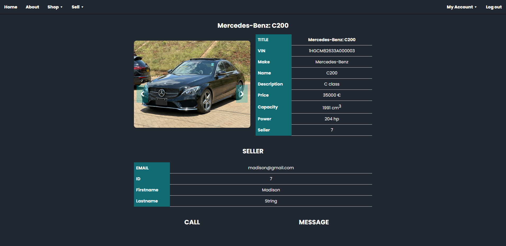
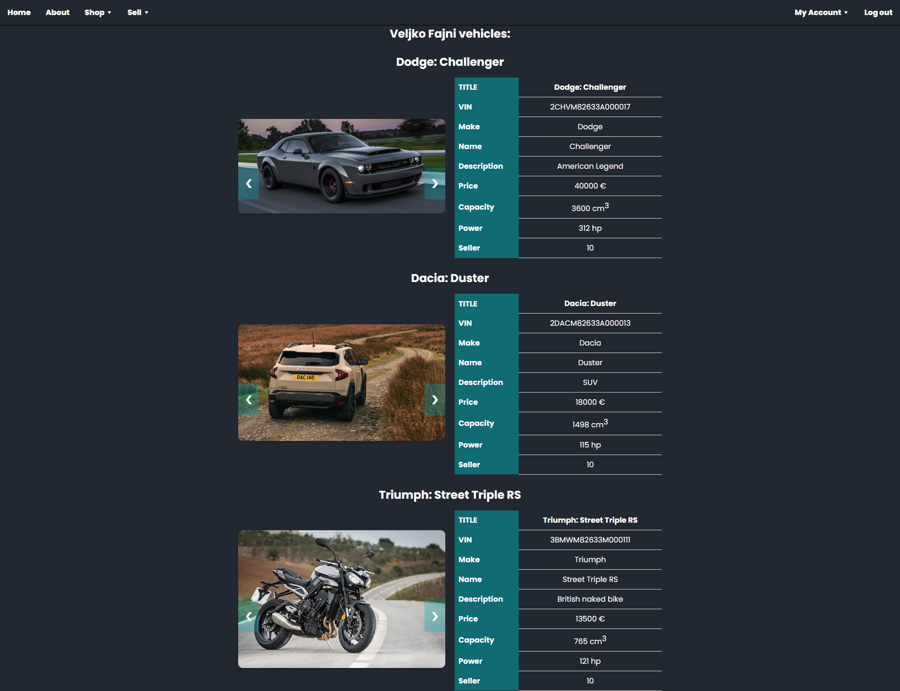
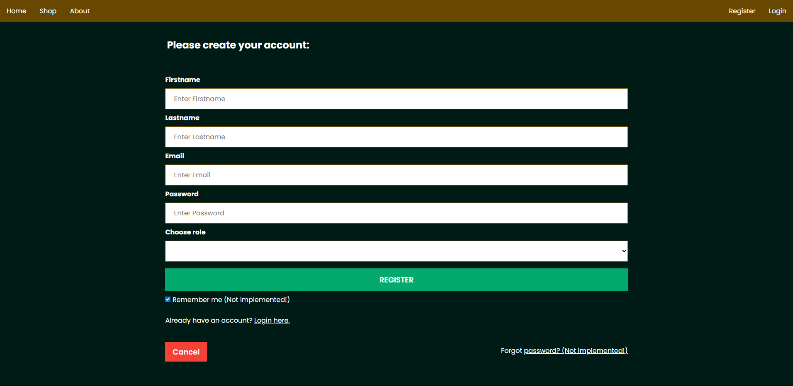
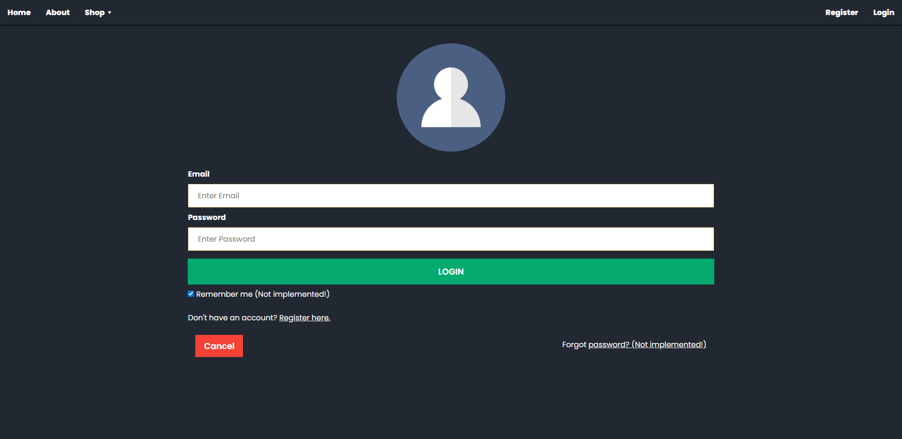
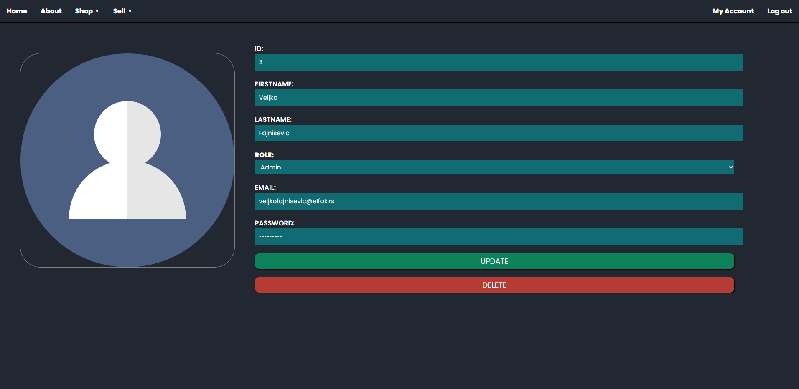

# ASP.NET-Angular-MySQL

This project is made for learning purposes.

- [Backend](#backend)
- [Frontend](#frontend)

## Backend

Simple API build in ASP.NET.

Database

## Frontend

Frontend in Angular 20.

IMAGES

- Home:

- About:

- Shop:

- Vehicle:

- Garage:

- Register:

- Login:

- My Account:

