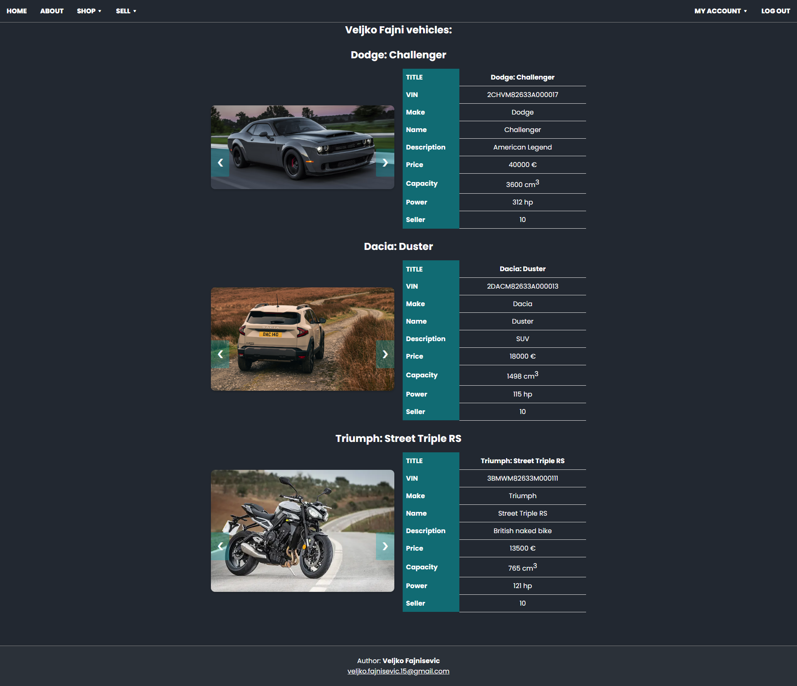

# ASP.NET-Angular-MySQL

Simple Vehicle Marketplace web app with login/registration functionalities. 

Cookie, MySQL, Angular 20, ASP.NET

This project is made for learning purposes.

- [Backend](#backend)
- [Frontend](#frontend)
- [TODO](#todo)

Live Demo...

## Backend

Simple API build in ASP.NET.

https://localhost:7000

Database

## Frontend

Frontend in Angular 20.

localhost:4200

IMAGES

- Home:

- About:

- Shop:

- Vehicles (_Cars_):

- Vehicle:

- Sell:

- Sell Car:

- Garage:

- Register:

- Login:

- My Account:

## TODO

- Pagination,
- Email sender, 
- Confirmation token,
- Cart (?)