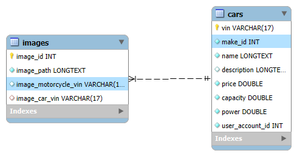

# Frontend for Vehicle Marketplace

- [Cookie](#cookie)
- [Some problems/solutions](#some-problemssolutions)

<hr/>

## Cookie

Cookie is automatically saved in browser from backend, but for
any request from frontend you need to add: `withCredentials: true`

Example:

```ts
public testAuthorization() {

    return this.httpClient.get(`${this.url}/test`, { withCredentials: true });
}
```

## Some problems/solutions

PROBLEM: subscription inside subscription - __anti-pattern__

- Problem:

```ts
public ngOnInit(): void {

    const subscription1 = this.loginService.testAuthorization().subscribe({
        next: (response) => {

            this.account = response;

            const subscription2 = this.carService.getUserCarsByUserId(this.account.id).subscribe({
                next: (response) => { this.cars = response; },
                error: (error) => { console.log(error); }
            });

            this.destroyRef.onDestroy(() => { subscription2.unsubscribe(); });

        },
        error: (error) => { console.log(error); }
    });

    this.destroyRef.onDestroy(() => { subscription.unsubscribe(); });
}
```

- Solution (_switchMap_):

```ts
public ngOnInit(): void {

    const subscription = this.loginService.testAuthorization().pipe(
        switchMap(response => this.accountService.getUserByEmail(response.userEmail!).pipe(
            map(account => ({...response, account}))
        )),
        switchMap(response => this.carService.getUserCarsByUserId(response.account!.id).pipe(
            map(cars => ({ ...response, cars }))
        ))
    ).subscribe({
        next: (response) => {
            // response will get new fields
            this.account = response.account;
            this.myCars = response.cars; 
        },
        error: (error) => { console.log(error); }
    });

    this.destroyRef.onDestroy(() => { subscription.unsubscribe(); });

}
```

<hr/>

PROBLEM (One-to-Many save): save parent entity then same child entity. (_Again subscription inside subscription_)

<p align="center">
    
</p>

- Problem:

```ts
public saveCarAndImages() {

    const subscriptionSellCar = this.sellCarService.addVehicle(car).subscribe({
        
        next: (savedCarResponse) => {

            console.log("Car saved:", savedCarResponse);

            for (let i = 0; i < extractedImages.length; i++) {

                const image: Image = {
                    carVin: car.vin,
                    src: extractedImages[i].src
                };

                console.log("Adding image:", image);

                const subscriptionAddImage = this.imageService.addImage(image).subscribe({
                    next: (savedImageResponse) => { console.log("Image saved:", savedImageResponse); },
                    error: (error) => { console.error("Error saving image:", error); }
                });

                this.destroyRef.onDestroy(() => subscriptionAddImage.unsubscribe());
            }

        },

        error: (error) => {
            console.error("Error saving car:", error);
        }

    });

    this.destroyRef.onDestroy(() => subscriptionSellCar.unsubscribe());
}
```

- Solution (_swithMap, forkJoin_):

```ts
public saveCarWithImages() {
    
    const subscription = this.sellCarService.addVehicle(car).pipe(
      
        /* 
            after you save the car, switchMap starts ?
            response in switchMap is the response from addVechile() 
        */
        switchMap((response) => {

            // map images into Observable list of calls, every image is send as individual HTTP request
            const imageRequests: Observable<string>[] = extractedImages.map(img => {
                
                const image: Image = {
                    carVin: car.vin,
                    src: img.src
                };

                // return value for Observable list
                return this.imageService.addImage(image);
            });

            // forkJoin starts all image requests parallel; emits 1 result
            // if 1 image fails, whole forkJoin fails
            return forkJoin(imageRequests);
        })

    )
    .subscribe({
      next: (response) => { console.log(response); },
      error: (error) => { console.log(error); }
    });

    this.destroyRef.onDestroy(() => subscription.unsubscribe());
}
```